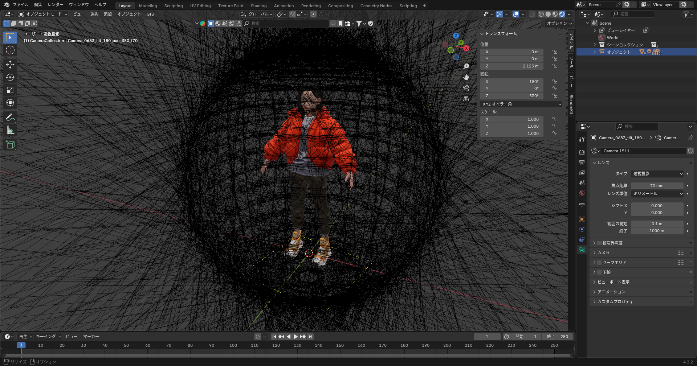

# Blender 360° Sweep for Gaussian Splatting (Postshot/RealityCapture)

This script automates the rendering of a 360-degree orbital camera sweep in Blender. It exports images along with precisely calculated camera metadata in **RealityCapture (CSV)** format and an **automated initial point cloud (PLY)** to ensure instant convergence in Gaussian Splatting (GS) training.



## Key Features

* **360° Orbital Path**: Automatically generates camera positions based on Tilt and Pan intervals.
* **Pixel-Perfect Metadata**: Calculates Focal Length in **pixels** and **35mm equivalent**, ensuring exact scale alignment between Blender and Postshot.
* **Auto-Scaled Initial Cloud**: Automatically generates a white, spherical point cloud based on camera distance to provide an ideal "seed" for GS training.
* **Dual-Format Export**: Generates both a `camera_data.json` for general use and a `camera_data.csv` for RealityCapture/Postshot compatibility.

## Installation & Requirements

1.  **Blender**: Tested on Blender 5.0+.
2.  **Scene Setup**: 
    * Place your target object at the scene origin or define `CENTER_POSITION` in the script.
    * Ensure your camera is active.

## Usage

1.  Open the `360_degree_sweep_by_blender.py` script in the Blender **Scripting** tab.
2.  Adjust the configuration constants at the top of the script:
    * `CENTER_POSITION`: The 3D coordinate the cameras will look at.
    * `RADIUS`: Distance from the center.
    * `PAN_INTERVAL` / `TILT_INTERVAL`: Step size in degrees (e.g., 30 for 12 shots per orbit).
3.  Run the script.
4.  The output will be saved in a folder named `generated_images` relative to your `.blend` file.

## Technical Specifications

### Camera Intrinsic Calculation
To ensure the scale is strictly 1:1, the script calculates the focal length using the sensor width and render resolution:

$$f_{pixel} = \frac{f_{mm} \times \text{Resolution}_{x}}{\text{Sensor\_Width}_{mm}}$$

It also provides the **35mm Equivalent** ($f_{35mm} = f_{mm} \times \frac{36.0}{Sensor\_Width}$) to satisfy software that assumes a full-frame sensor by default.

### Output Structure
```text
gs_output/
├── 0001.jpg            # Rendered frames
├── 0002.jpg
├── camera_data.json        # Detailed metadata (JSON)
├── camera_data.csv         # RealityCapture-compatible CSV
└── init_guide_points.ply   # Automatic white point cloud for initialization

```

## Importing to Postshot

1. Launch **Postshot**.
2. Drag the entire `generated_images` folder into the workspace.
3. Postshot will recognize the `camera_data.csv` for camera positions and `init_guide_points.ply` as the initial sparse points.
4. Start training. Since the points are perfectly centered around your object, training should converge significantly faster.

## License

MIT
